# JuanMecánico: Un Bot de Telegram para Automatización Automovilística

## Introducción
A continuación voy a mostrar un ejemplo más complejo de como se puede usar las automatizaciones para crear una "herramienta" atractiva y divertida. En este caso se trata de usar un bot de Telegram que anteriormente hemos creado llamado JuanMecánico, diseñado para facilitar diversas tareas relacionadas con el automovilismo. Este bot permite a los usuarios acceder a información, recibir noticias, realizar consultas y más, todo de manera automatizada.

## Objetivo
El propósito de esta automatización es demostrar un escenario complejo en Make donde múltiples flujos de trabajo se combinan en un solo sistema controlado a través de un bot de Telegram. Los usuarios podrán interactuar con el bot para obtener datos, recibir notificaciones y gestionar diversas acciones relacionadas con el mundo automovilístico.


## Diseño de la automatización

Antes de comenzar con las funcionalidades implementadas y como se han configurado creo que es importante tener un idea de como realizar este ejemplo y utilizar patrones de diseño para que todo tenga un sentido y propósito espcífico.

Para este ejemplo no solo vamos a utilizar un patron, sino vamos a combinar diferentes patrones que nos dará como resultado nuestro flujo de trabajo (workflow). Este patron de diseño que surge de combinar los patrones que voy a mencionar a continuación me gusta llamarlo "Skynet Jr.". Para contextualizar un poco el nombre para quienes no comprendan la referencia aquí dejo una breve explicación:

> Skynet Jr. es patron de diseño que "configura" un workflow / sistema automatizado en la IA de la saga [*Terminator*](https://www.google.com/search?client=firefox-b-d&q=terminator), en este caso la misión no es conquistar el mundo sino hacer más fácil la gestion de diferentes tareas, estas son las funcionalidades implementadas.


Los patrones necesarios para el diseño de este ejemplo son los siguientes:

### Patrón de Enrutamiento (Router pattern)

Vamos a necesitar un router (módulo de Make) "central" que distribuye las tareas según diferentes condiciones.

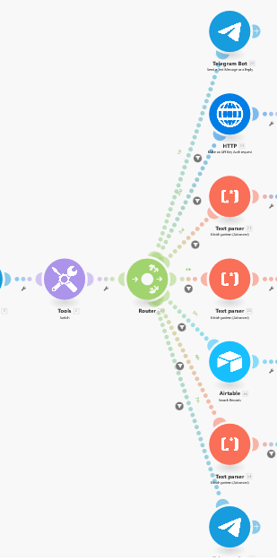

### Patrón de Microservicios

Se analizamos las funcionalidades que se presentan más adelante, una vez pasado el modulo router tenemos diferentes servicios que componen el workflow. Desde la obtención de noticias con apis, gestion de una base de datos en AirTable, mostrar un menu con comandos al usuario desde el chat de Telegram...etc.

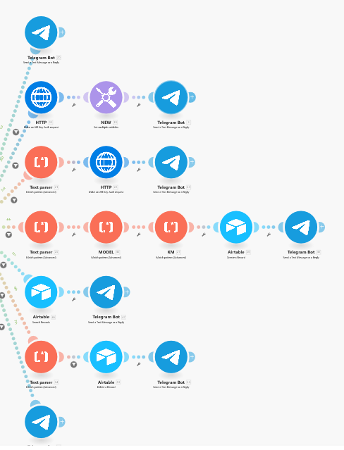

### Patrón de Mediador (Mediator Pattern)

Antes de llegar al modulo router para distribuir la petición en los diferentes "microservicios" comentados anteriormente necesitamos un mediador que procese la información y le "indique" al router por donde debe dirigirse el flujo de trabajo. Es decir, si consumir uno de los microservicios disponibles y otros.

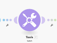

### Patrón de Observador (Observer Pattern)

Ya que nuestro trigger principal y único es ejecutar el workflow al recibir datos a través del webhook del bot de Telegram, este trigger actúa como un observador.


### Patrón de Adaptador (Adapter Pattern)

Para que todo el workflow funcione correctamente en diversos puntos necesitamos colocar parsers y filtros que controlen y tranformen datos de un formato a otro legible para devolver la información o servicio que el usuario nos pida a través de los comandos disponibles en el Bot de Telegram.

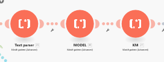


Como se puede observar cada pieza o en este caso cada modulo agregado y configurado debe seguir un orden y tiene un comportamiento que si lo trasladamos a patrones de diseño adquiere un significado y contexto importante para el comportamiento objetivo de la automatización. Personalmente, creo que es importante definir ,antes de comenzar con la creación y configuración de nuestro escenario de Make, de forma clara los "pasos" que necesitamos completar para completar el objetivo que se proponga. De esta forma el uso de patrones de diseño nos permite establecer de forma más clara como se comportará y que agentes (en este caso modulos) intervienen en el flujo de nuestra automatización.

Para concluir con esta sección, en este caso al definirse diferentes servicios disponibles para el usuario "final" podríamos optar solo por el patron de microservicios, pero realmente no solo ofrecer diferentes servicios sino que también es necesaro definir las comunicaciones y comportamientos de unos servicios con otros.

## 1. Funcionalidades Principales
A través del bot de telegram llamado JuanMecanico, los usuarios podrán:

### 📢 **Noticias Automovilísticas**
- El bot obtiene cada hora las últimas noticias sobre automovilismo (rally,clubs JDM, Fórmula 1, etc.) de una API de noticias.
- Resumen de cada noticia generado con GPT-4, otro modelo.
    
    En este caso solo se ha implementado la obtención de una noticia a través de la api de [newsapi](https://newsapi.org).
    Para usarla solo es necesario indicar algunos query parameters, entre ellos la api key que se debe obtener desde su web.
    ```PLAINTEXT
        https://newsapi.org/v2/top-headlines?category=sports&language=en&pageSize=1&apiKey=api_key
    ```
    Esto parámetros son:

    - `/v2/top-headlines`: apunta al endpoint y permite obtener los printipales titulares de noticias.
    - `category=sports`: filtra las noticias por categoria.
            
        Las categorias que dispone este api son: business, entertaiment, health, science, technology, sport y algunas más. Ya que no existe una categoría espcíficas de automóviles he decidido usar la de sports.

    - `language`: especifica el idioma de las noticias (en, fr, es, de).
    - `pageSize`: indica la cantidad de noticias a devolver.
    - `apiKey`: se debe indicar la calve API proporcionada por newsapi desde su web (es "necesario registrarse")

    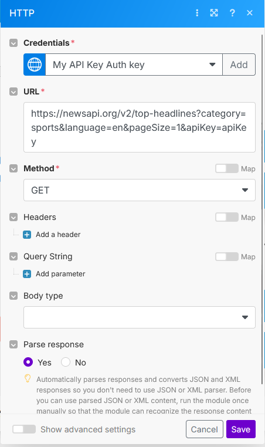

    Es importante marcar la opción de "Parse Response", de esta manera nos devolvera un collections con las noticias, en caso de indicar `pageSize=1` solo se devolvera un collections con 1 noticia. En caso de indicar más podremos iterar la "lista" para trabajar con las noticias.

    Llegados a este punto sería ideal enviar la noticia a chatGpt para realizar un resumen, en este caso ya que para usar la api de GPT es necesario agregar método de pago he optado por solo quedarme con la descripción de la noticia (resumen), el titulo y la url para enviarsela al usuario a través del bot de telegram.

    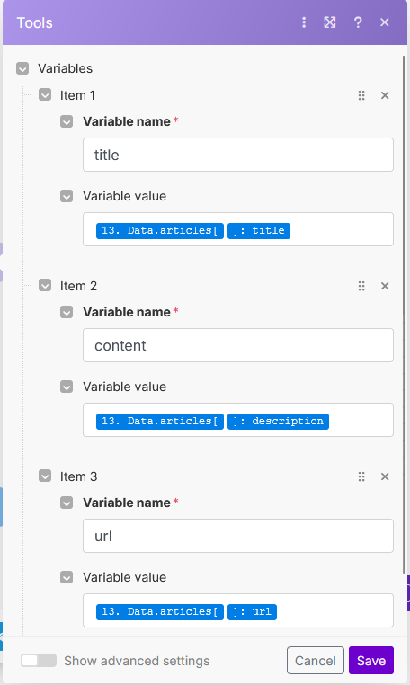

    Para realizar esto he usado el modulo tools para "setear" (palabra "inventada" que viene de setters) algunas variables, el titulo, contenido de la noticia (resumen) y la url.

    Finalmente con el modulo de telegram para enviar mensajes o reenviar mensajes se le envia la info al id del chat que solicita la noticia:

    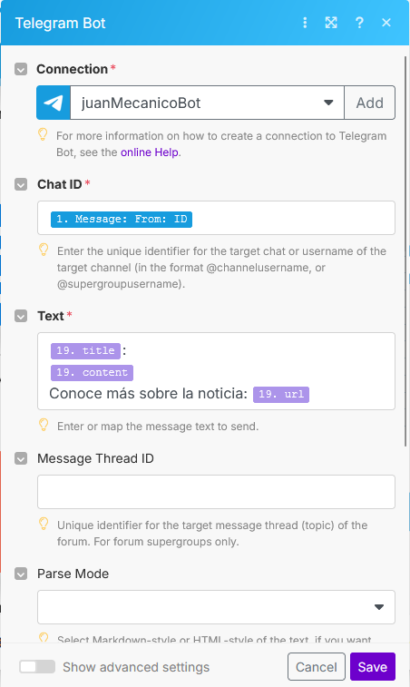


- Almacenamiento de las noticias en Airtable.
- Opción para que el usuario reciba un resumen diario o instantáneo de las noticias en su chat de Telegram.


### ⚙️ **Consulta de Especificaciones de Vehículos** [⚠️ NO IMPLEMENTADO]

La idea de esta funcionalidad es poder consultar especificaciones de vehiculos con el comando /especificaciones {marca, modelo de coche} a través del chat de telegram y recibir las specs de dicho coche o un mensaje de error en caso de no encontrarlo.

El funcionamiento consiste , como he comentado, en solicitar a una api con datos de vehiculos información a nivel técnivo de un vehiculo. Ejemplo: /especificaciones peugeot 308, el bot debe devolver especs como el numero de puertas, tipo de tracción, motor, tipo de combustión, caballos de fuerza ...etc.

La api encontrada tiene diversas limitaciones, entre ellas no poder buscar por marca y modelo, solo permite por modelo y esto hace que sea algo inutil (apreciación personal). Además que si deseamos buscar que modelos tiene una marca solo esta disponible para cuentas premium dentro de la plataforma donde esta "hosteada" la api, así como limitacion en el uso de alguno parametros filtros para buscar vehiculos.

Por ejemplo, supongamos que deseamos buscar como hemos indicado antes el peugeout 308, para esto debemos buscar de la siguiente manera:

    /especificaciones 308

Al realizar esta petición nos devolvera información de un ferrari 308 y no del peugeot, es decir, no contiene especificaciones de todos los modelos de todas las marcas o al menos no nos permite "de forma grauita" filtrar mejor. Por otro, lado al encontrarnos la limitación de cierto tipo de consultas con ciertos parámetros por no disponer de una cuenta premium no podemos comprobar que modelos tiene de peugeot, por ejemplo.

Dejando las quejas a un lado, pasemos a ver la implementación en Make.

Para empezar volvemos a usar el modelo de HTTPs para hacer un get:

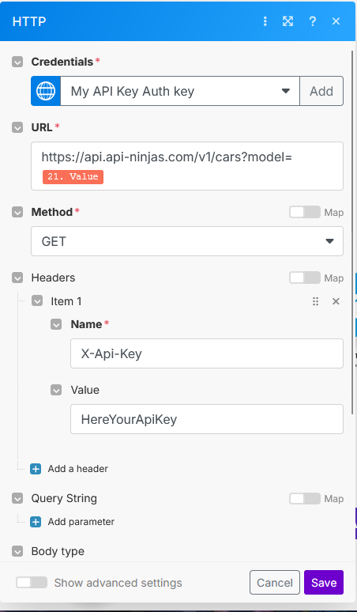

En este caso la api es:
```PLAINTEXT
    https://api.api-ninjas.com/v1/cars?model=​{model_name}
```
Y en el header debemos indicar la api key con el parametro:
```PLAINTEXT
    X-Api-Key
```
La api usada es la api de cars v1 de [api-ninjas](https://www.api-ninjas.com/).

Además, antes de realizar esta petición debemos usar un text parse para obtener del comando recibido el modelo del vehiculo:
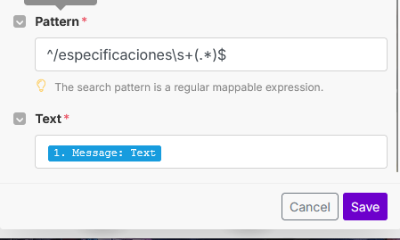

### ⏰ **Mantenimiento**
- Los usuarios pueden registrar sus vehículos en el bot.(realmente se registran en airtable)

Esta funcionalidad tiene una "brecha de seguridad" o limitación (en función de a quién le preguntas). Todos los datos de AirTable son accesibles desde el bot, por lo que si un usuario A introduce el kilometraje y modelo de su coche el usuario B pude verlo o incluso eliminarlo de la "base de datos". Ya que se trata de probar automatizaciones en Make y crear un piloto funcional para probarlo creo que es una solución temporal adecuada. Además, todos los usuarios pueden ver los vehiculos del resto "de la comunidad". Seria interesante deprecar la opción de "/eliminar" de esta manera evitamos problemas, y si usamos el bot en un grupo, los usuarios "fanaticos" por los coches pueden ver los vehiculos del resto del canal o grupo.

Volviendo a la parte técnico, solo tenemos que utilizar el parse para obtener ambos datos (model y km) y enviarlo a airtable, además de enviar un mensaje para indicar que todo fue un éxito.

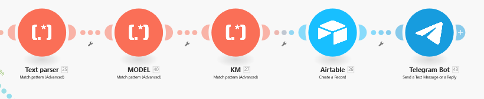

Para obtener los vehiculos y eliminarlos es similar:

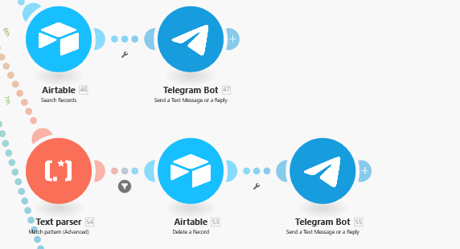

Creo que no es necesario explicar paso por paso todo lo configurado, pero en caso de que sea de interés se puede importar este ejemplo en Make de manera que se pueden ver cada modulo creado de forma detallada y aprender sobre el papel.

Fichero JSON para la importación -> [JSON](JuanMecanicoAutomation.json)


### 🔧 **Asistencia Mecánica**
Esta funcionalidad debido a limitaciones de tiempo el alcance actual consiste en devolver al usuario un mensaje indicando que no hay técnicos disponibles en estos momentos y recomienda visitar una web que proporciona tutoriales de practicamente todos los vehiculos para poder realizar mantenimientos y reparaciones.

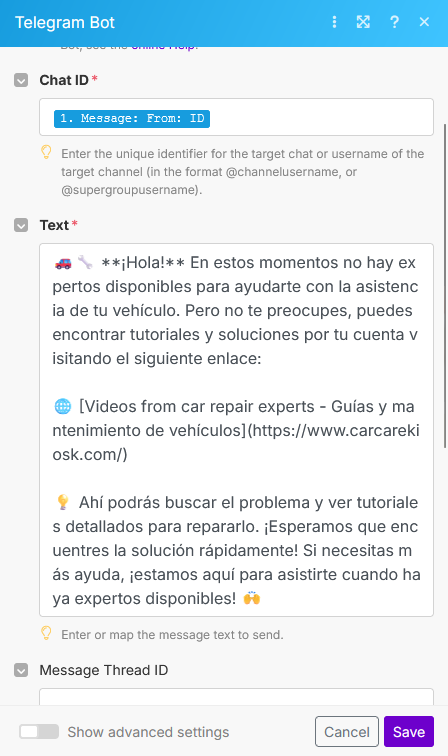

## 2. Arquitectura de la Automatización
Cada funcionalidad está estructurada en flujos de trabajo dentro de Make, conectando diferentes módulos de manera eficiente.

### **Triggers y Actions:**

#### 🏁 **Trigger Principal: Interacción en Telegram**
- **Trigger:** `Watch Updates (Telegram Bot)` - Captura mensajes de los usuarios y los analiza para determinar la acción a realizar.
- **Acción:** Analiza el comando del usuario y ejecuta el flujo correspondiente.

#### 📰 **Noticias Deportivas**
- **Trigger:** `Scheduler (cada hora)`
- **Acción 1:** Obtener noticias de la API de automovilismo.
- **Acción 2:** Pasar cada noticia por GPT-4 para generar un resumen atractivo. [⚠️ NO IMPLEMENTADA]
- **Acción 4:** Enviar noticias a usuarios a través de Telegram.

#### 🚘 **Consulta de Especificaciones de Vehículos**
- **Trigger:** Mensaje en Telegram con el modelo del coche.
- **Acción 1:** Consultar API de especificaciones(cars/v1) de vehículos.
- **Acción 2:** Enviarla al usuario.

#### 🛠️ **Asistencia Mecánica**
- **Trigger:** Mensaje en Telegram con el comando especificado /mecanico
- **Acción 2:** Enviar mensaje con disponibilidad de técnicos y recomendación de web con información de vehiculos.

## 3. Integraciones Utilizadas
| Integración | Uso |
|------------|-----|
| **Telegram Bot** | Comunicación con los usuarios |
| **NewsAPI** | Obtención de noticias |
| **OpenAI GPT-4 o deepseekr1-13b local** | Generación de resúmenes y asistencia IA |
| **Airtable** | Almacenamiento de datos |
| **API de Vehículos** | Consulta de especificaciones |

## 4. Mejoras Futuras
- 📍 **Localización de talleres cercanos** con Google Maps API.
- 📊 **Comparación de modelos de autos** basada en datos técnicos.
- 🔗 **Publicación automática de noticias** en redes sociales (Twitter, Facebook).
- 🤖 **Asistente de voz** para consultas interactivas dentro de Telegram.

## Conclusión
Este escenario de automatización demuestra cómo se pueden combinar múltiples procesos dentro de Make para crear un sistema robusto y altamente interactivo sin conocimientos técnicos. JuanMecánico es un bot potente que centraliza información y asistencia automovilística en un solo canal de comunicación, mostrando el potencial de la automatización avanzada en Telegram.

## Capturas

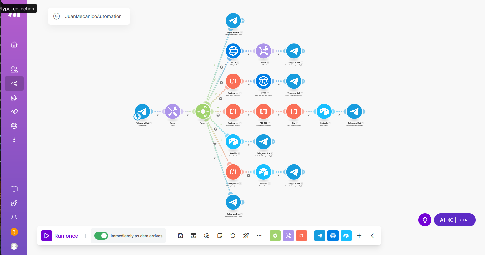


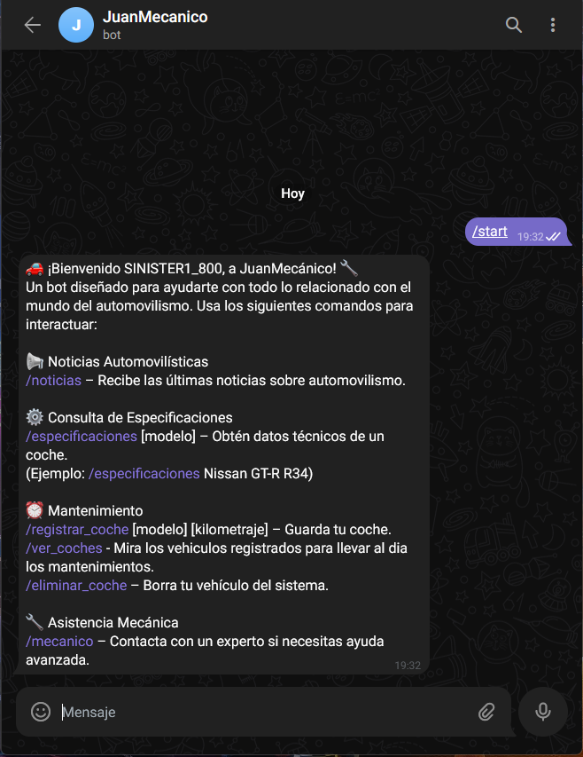