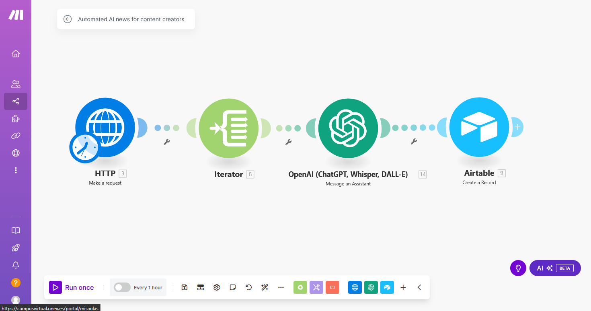

# Automated AI News for Content Creators

## Descripción
Este escenario permite automatizar la obtención, procesamiento y almacenamiento de noticas en este caso de índole tecnológico y preparar publicaciones automaticas para los creadores de contenidos.

Cada hora, la automatización obtiene las noticias más recientes, las procesa con IA y se obtienen publicaciones para redes sociales y se almacenan en AirTable para su posterior revisión o uso.

## Patrón de diseño aplicado

**Orchestration**: este patrón es el más adecuado debido a la secuencia estructurada de pasos, donde cada acción depende de la anterior para garantizar un flujo de trabajo coherente y eficiente.

## Triggers y acciones
### Trigger
- **Ejecutar cada 1 hora**
  - Se obtiene información de noticias tecnológicas desde la API de [NewsAPI](https://newsapi.org/):
    ```
    https://newsapi.org/v2/top-headlines?category=technology&language=en&pageSize=10&apiKey=API-KEY
    ```
  - Se obtiene la data de `articles[]` para procesar cada una de las noticias individualmente.

### Acciones
1. **Iterar sobre los artículos recibidos**
   - Se usa un iterador para recorrer la lista de noticias y procesarlas una por una.
   
2. **Procesar cada noticia con GPT**
   - Se envía la siguiente solicitud a OpenAI (GPT):
     ```
     Resumir la siguiente noticia en un post para X (Twitter) de máximo 280 caracteres:
     
     Título: {title}
     Publicación: {content}
     URL: {url}
     
     Hazlo atractivo, directo y añade hashtags relevantes.
     ```
   - Se recibe la respuesta con un post listo para ser publicado.

3. **Almacenar la información en Airtable**
   - Se guarda el resumen generado en una base de datos de Airtable, junto con el título de la noticia y la URL original.

## Conexión entre Triggers y Acciones
1. **Trigger:** Se ejecuta cada hora y obtiene noticias de la API de NewsAPI.
2. **Iterador:** Se desglosan los artículos en elementos individuales.
3. **GPT:** Se procesa cada artículo para generar un resumen.
4. **Almacenar en Airtable:** Se guardan los resúmenes generados para que el creador de contenido pueda revisarlos o utilizarlos.

## Posibles Mejoras
- Implementar una **acción aleatoria** para publicar directamente en una de las redes sociales integradas en Make (Twitter, LinkedIn, etc.).
- Incluir un mecanismo de validación para evitar noticias duplicadas en Airtable.
- Configurar alertas para que el usuario reciba notificaciones cuando haya nuevos posts generados.
- Ampliar la funcionalidad para obtener noticias en distintos idiomas y procesarlas según la audiencia objetivo.

Captura del escenario:

