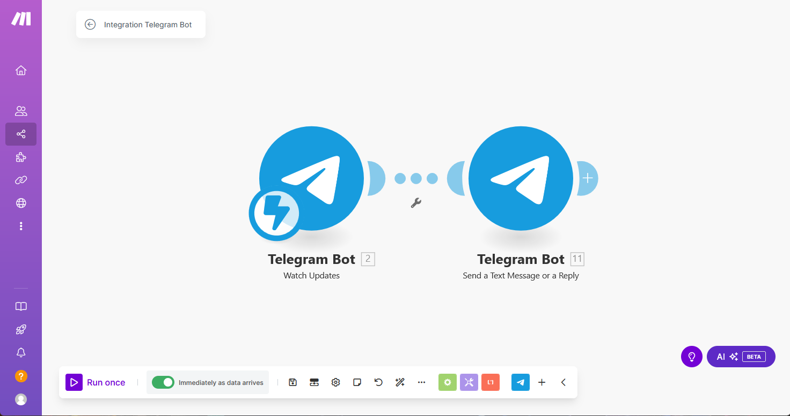
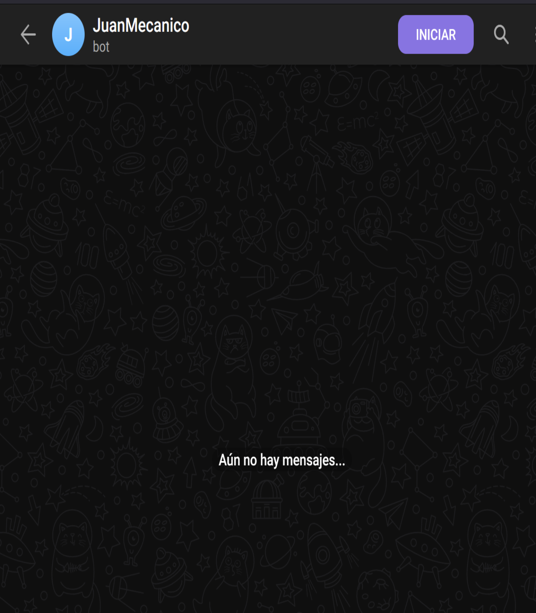
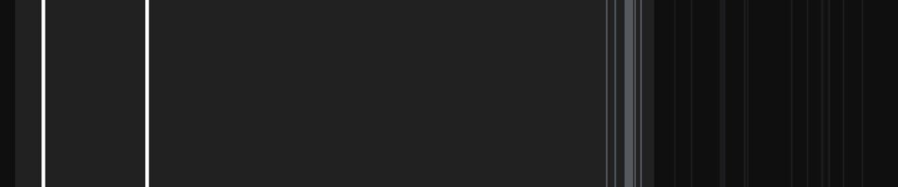

# Automated Telegram Bot

## Descripción
Este workflow permite que un bot de Telegram responda automáticamente con el mismo mensaje cada vez que se inicia la conversación o se recibe cualquier mensaje por parte del usuario.

## Patrón de diseño aplicado

Event-Driven: un evento desencadena otro, en este caso recibir un mensaje deriva en enviar otro de vuelta.

## Triggers y acciones
### Trigger
- **Telegram - Webhook de "watchUpdates"**
  - Detecta cuando un usuario inicia el chat o envía un mensaje.
  - Se debe configurar el webhook con el token del bot para recibir las actualizaciones de mensajes.
  - Para configurar el bot en Telegram, consulta la documentación: [crear_bot_telegram.md](/docs/crear_bot_telegram.md).

### Acción
1. **Enviar mensaje de respuesta**
   - Acción: "Send message" o "Reply message" en Telegram.
   - Contenido del mensaje:
     > "¡Hola, {username}!\nSoy JuanMecanico, tu mecánico digital de confianza 😉. ¿Cómo puedo ayudarte hoy?"
   - Parámetro: ID del chat (obtenido en el webhook de "watchUpdates").

## Conexión entre Triggers y Acciones
1. **Trigger:** Se activa cuando un usuario inicia conversación o envía un mensaje al bot.
2. **Acción:** Se extrae el ID del chat y el nombre de usuario.
3. **Acción:** Se envía automáticamente el mensaje predefinido al usuario a través del bot.

## Posibles Mejoras
- Agregar lógica condicional para personalizar respuestas según el mensaje recibido.
    
        Se puede usar un switch o if-else de los chat-text obtenidos para filtrar si se indican comandos
        o las respuestas que se buscan.
- Implementar un menú de opciones utilizando "Inline Keyboards" en Telegram.
- Registrar interacciones en una base de datos como Google Sheets o Airtable para análisis posterior.
        
        Personalmente no creo que sea una mejora (prefiero que los usuarios "tengan privacidad") aunque
        esta pueda hacer que el servicio que se le ofrezca sea de alta calidad para sus necesidades

## Capturas de funcionamiento

Como se puede observar, esta configurado para que funcione en cuanto recibe datos.

Al iniciar el bot nos responderá automáticamente

