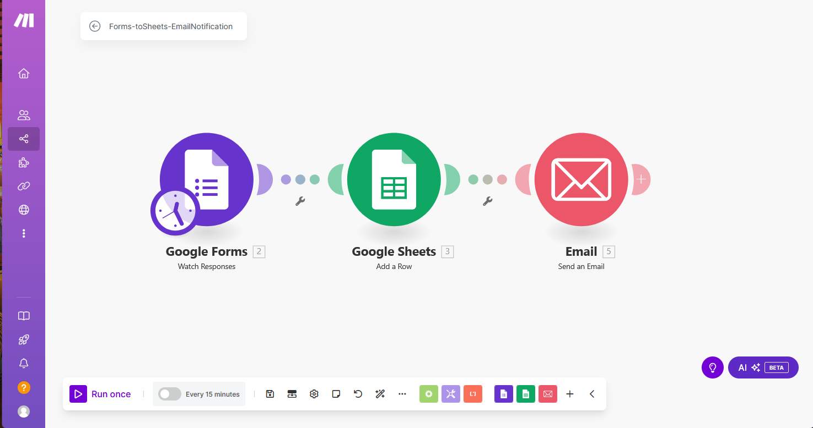

# Form-toSheets-EmailNotifications 

## Descripción
La idea de este workflow es recibir información de respuestas registradas en un form de Google cada 15 minutos, almacenar los datos en una hoja de cálculo en Google sheets y enviar una notificación por correo al creador del form (nosotros) o al usuario que respondió (en caso de que el form recoja su correo).

## Patrón de diseño aplicado

**Event-Driven**: este patron es ideal ya se activa o realizan las acciones en función de un evento externo. Aunque en make para activar dicho "trigger", que es recibir datos del form, es necesario configurar que cada x tiempo se ejecute dicha acción, realmente hasta que no hay datos no se realizan los siguientes pasos. Es decir, en make es necesario activar un módulo (acciones o triggers que configuremos) ya sea manualmente, periodicamente o en una fecha y hora concreta; por lo el trigger siempre es configurado para "activar" el escenario, una vez activado el trigger como tal ya será recibir los datos del form.

## Triggers y acciones
### Trigger

- Google Forms - Obtener nuevas respuestas (cada 15 minutos)
Debido a la limitación del plan gratuito de Make, la frecuencia mínima de ejecución es de 15 minutos.

### Acciones

- Enviar datos a Google Sheets
1. Extraer el ID de la pregunta y la respuesta.
2. Agregar la información a una fila nueva en una hoja de Google Sheets específica.

- Enviar correo electrónico de notificación

1. Si el formulario recopila el correo electrónico del usuario:

    Enviar una notificación al usuario confirmando que su respuesta ha sido recibida.

2. Si no se recoge el correo electrónico del usuario:

    Enviar una notificación al creador del formulario con los datos recibidos.

## Conexión entre Triggers y Acciones

1. Trigger: Se ejecuta cada 15 minutos y obtiene las respuestas del formulario.

2. Acción: Se formatea y almacena la información en Google Sheets.

3. Condición: Se evalúa si hay un correo electrónico del usuario. (opcional)

4. Acción: Dependiendo de la condición anterior, se envía un correo al usuario o al creador del formulario.

## Posibles Mejoras

- Implementar una sentencia IF para verificar si se obtuvo el correo del usuario y así decidir automáticamente a quién enviar la notificación.

- Agregar una acción adicional para registrar el estado de cada notificación enviada en Google Sheets.

- Incluir un log en una herramienta como Airtable o Notion para llevar un control detallado de las respuestas procesadas.

A continuación una captura del escenario de Make:
